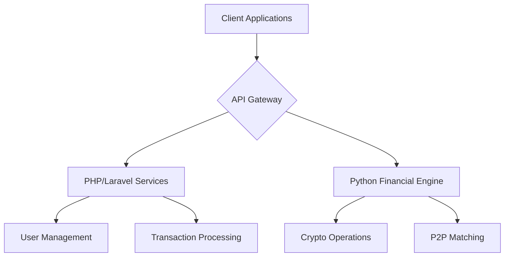

# Bluqq - Unified Financial Platform 

**Bluqq** is a comprehensive financial technology platform designed to empower users with secure, efficient, and integrated monetary solutions. Combining traditional financial services with modern digital asset capabilities, Bluqq provides a seamless experience for personal and commercial transactions.

## Core Capabilities  
**Financial Services**  
- **Instant Transfers**: Send/receive funds between users  
- **Escrow Services**: Secured transaction mediation  
- **P2P Marketplace**: Trusted peer-to-peer trading  
- **Crypto Exchange**: Digital asset conversion  
- **Unified Wallet**: Manage multiple asset types  

**Security Framework**  
- Multi-layer authentication  
- Transaction encryption  
- Real-time monitoring  
- Dual-confirmation protocols  

## Platform Architecture  
Bluqq leverages a hybrid microservices architecture:  



## Getting Started  

### Installation  
1. Clone repository:  
```bash
git clone https://github.com/bluqq/platform.git
cd platform
```

2. Initialize environment:  
```bash
cp .env.example .env
docker-compose build
```

3. Launch services:  
```bash
docker-compose up -d
```

4. Platform Access:  
- Web Interface: Coming Soon  
- API Documentation: Coming Soon  

## Development Status  

| Module | Status |  
|--------|--------|  
| Core Banking | ✅ In Development |  
| Escrow Services | ✅ In Development |  
| Crypto Exchange | 🚧 Advanced Development |  
| P2P Marketplace | 🚧 In Development |  

## Contributing  
We welcome contributions through our structured process:  

1. **Proposal Submission**  
   Submit feature proposals via GitHub Discussions  
   
2. **Branch Naming**  
   `{feature-type}/{module}-{description}`  
   Example: `enhancement/escrow-auto-release`  

3. **Development Standards**  
   - PHP: PSR-12 compliance  
   - Python: PEP 8 with type annotations  
   - Comprehensive test coverage  

---

**Contact**  
Business Inquiries titusjustin896@gmail.com  
Technical Support: titusjustin896@gmail.com 

*Bluqq Financial Technologies • Aba, Nigeria*  

> Secure financial infrastructure for modern Africa
